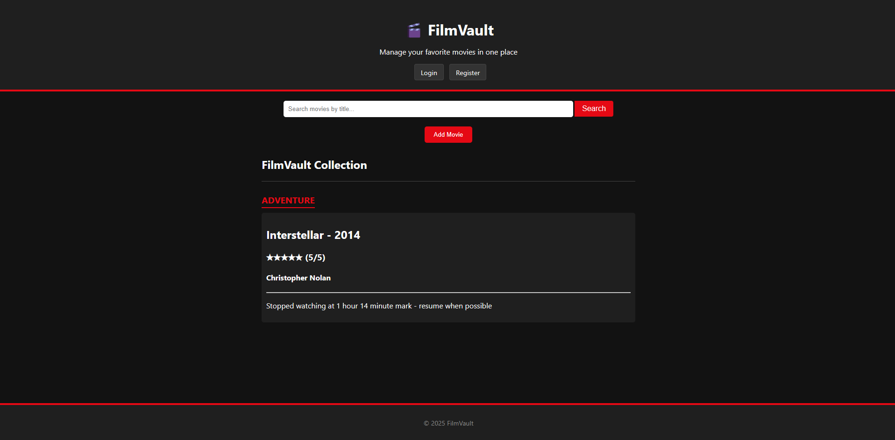
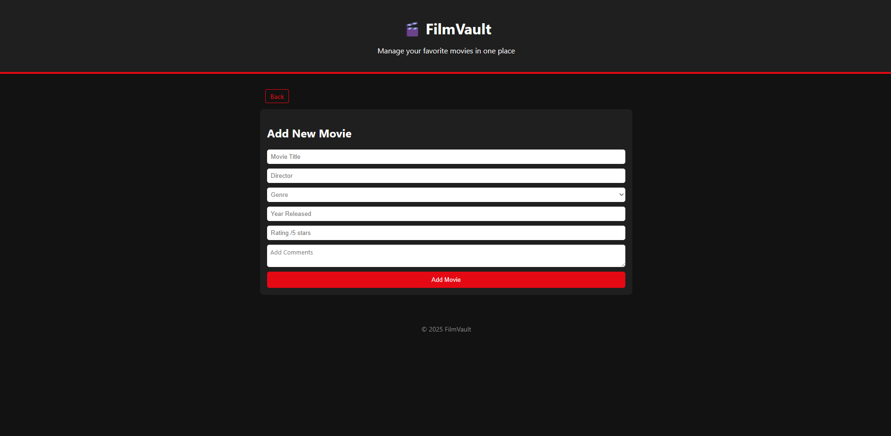
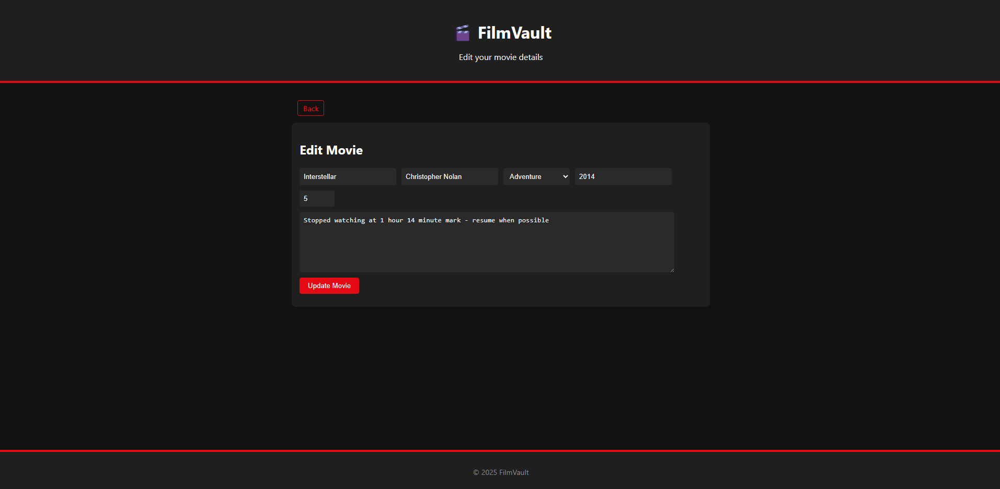
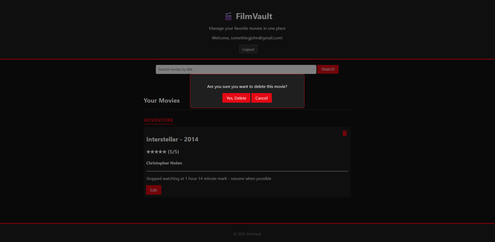

# 🎬 FilmVault

**A full-stack movie manager app built with Node.js, Express, and MariaDB.**  
View the live site here: 👉 [https://filmvault.site](https://filmvault.site)

---

## Features
- Add, edit, and delete movies in your collection  
- Search and sort by title, genre, release year, or rating  
- Backend with RESTful routes for managing movie data  
- Responsive design for desktop and mobile  
- Hosted on Google Cloud

## Tech Stack
**Frontend:** HTML, CSS, JavaScript  
**Backend:** Node.js, Express  
**Database:** MariaDB  
**Cloud:** Google Cloud Platform (GCP)  
**Version Control:** Git

## 📸 Screenshots

### 🏠 Home Page

### ➕ Add Movie Modal

### 🔄 Update Movie Modal

### ❌ Delete Movie Modal

